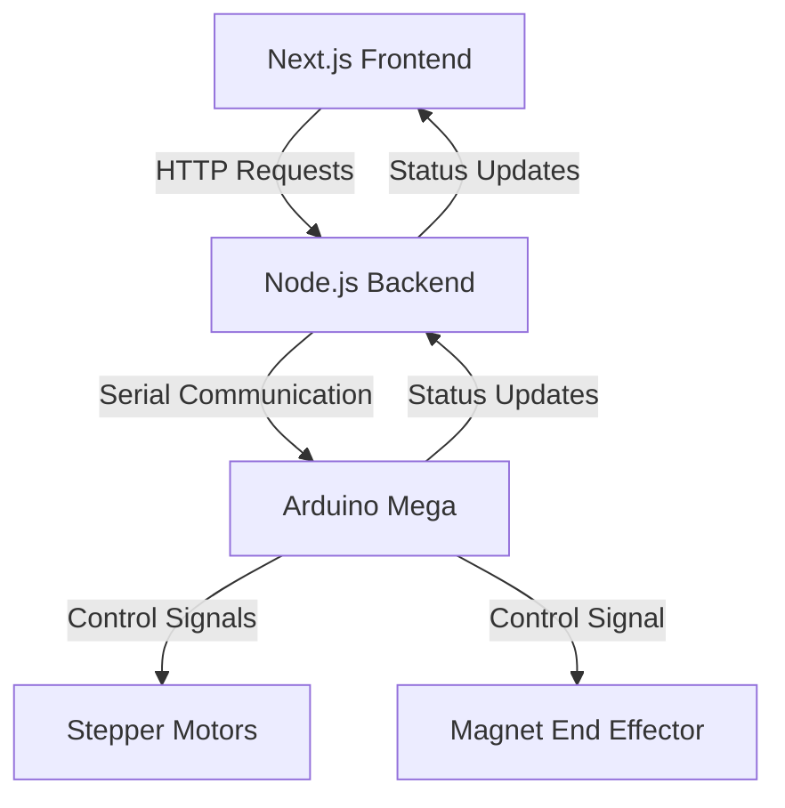

# SCARA Robot Control System

A **comprehensive control system** for a **4-axis SCARA robot**, integrating an **Express.js backend API**, **Next.js frontend**, and **Arduino Mega firmware** for **precise motion control**.

## Demo Video

<div align="center">
  <video width="640" height="360" controls>
    <source src="demo.mp4" type="video/mp4">
    Your browser does not support the video tag.
  </video>
</div>

## 🚀 Project Overview

This project enables remote control and automation of a **SCARA robot**, incorporating:

- **4 NEMA 17 Stepper Motors** (Base rotation, Shoulder, Elbow, Z-axis)
- **Electromagnetic End Effector** (Magnet-based gripping mechanism)
- **Web-based Control Interface** (Next.js, TypeScript, Shadcn, TailwindCSS)
- **Backend API for Communication** (Express.js, TypeScript)
- **Arduino Firmware for Hardware Control** (Arduino Mega)
- **Custom 3D Printed Parts** for structure and motion control

## 📜 System Architecture



## 🔩 Hardware Components

| Component           | Details                               |
| ------------------- | ------------------------------------- |
| **Microcontroller** | Arduino Mega 2560                     |
| **Motors**          | 4 x NEMA 17 Stepper Motors            |
| **Motor Drivers**   | A4988 Stepper Motor Driver            |
| **End Effector**    | Electromagnetic Gripper               |
| **Power Supply**    | 12V DC for motors, 5V for electronics |
| **Belts & Pulleys** | GT2 Timing Belt (200mm, 300mm, 400mm) |
| **Frame & Links**   | Custom 3D Printed PLA Components      |

## 🖥️ Software Components

### 1️⃣ **Arduino Firmware (`arduino_scara.ino`)**

- Utilizes **AccelStepper** library for precise motor control
- Processes **serial commands** for movement and magnet control
- Implements **safety features** and **position tracking**

### 2️⃣ **Express.js Backend API**

- Manages **serial communication** with the Arduino
- Provides a **RESTful API** for robot control
- Handles **port management** and **command processing**

### 3️⃣ **Next.js Frontend**

- Web-based **control panel** with real-time robot status
- **Interactive UI** for manual and automated control
- **Responsive design** for both desktop and mobile

## ⚙️ Installation and Setup

### 🔹 **1. Clone the Repository**

```sh
git clone https://github.com/ayuugoyal/scara.git
cd scara
```

### 🔹 **2. Arduino Setup**

1. Install the **Arduino IDE**
2. Install the **AccelStepper** library via the Library Manager
3. Connect the **Arduino Mega** to your computer
4. Upload `arduino_scara.ino` to the Arduino

### 🔹 **3. Hardware Connections**

#### **Stepper Motors to Motor Drivers:**

| Axis          | STEP Pin | DIR Pin | ENABLE Pin |
| ------------- | -------- | ------- | ---------- |
| Base Rotation | 2        | 3       | 4          |
| Shoulder      | 5        | 6       | 7          |
| Elbow         | 8        | 9       | 10         |
| Z-Axis        | 11       | 12      | 13         |

- **Magnet Connection** → Pin **53**
- **Power Supply** → 12V for motors, 5V for logic circuits

### 🔹 **4. Backend Setup**

```sh
cd backend
pnpm install
pnpm run dev  # Development mode
pnpm start    # Production mode
```

- Runs on **http://localhost:3001** by default

### 🔹 **5. Frontend Setup**

```sh
cd frontend
pnpm install
pnpm run dev
```

- Access UI at **http://localhost:3000**

## 📡 API Documentation

### **Port Management Endpoints**

| Method | Endpoint          | Description                                                        |
| ------ | ----------------- | ------------------------------------------------------------------ |
| GET    | `/api/ports`      | List available serial ports                                        |
| POST   | `/api/connect`    | Connect to a port (`{"port": "/dev/ttyUSB0", "baudRate": 115200}`) |
| POST   | `/api/disconnect` | Disconnect the current port                                        |
| GET    | `/api/status`     | Get connection status                                              |

### **Robot Control Endpoints**

| Method | Endpoint       | Description                                                  |
| ------ | -------------- | ------------------------------------------------------------ |
| POST   | `/api/command` | Send a movement command (`{"command": "M0 200 1000"}`)       |
| POST   | `/api/magnet`  | Control the magnet (`{"state": true}` or `{"state": false}`) |

### **Arduino Serial Commands**

| Command                             | Description                     |
| ----------------------------------- | ------------------------------- |
| `M{motor_index} {position} {speed}` | Move motor to specific position |
| `M,1`                               | **Turn on** electromagnet       |
| `M,0`                               | **Turn off** electromagnet      |

## 📂 Project Structure

```
scara/
├── arduino_scara/          # Arduino firmware
│   └── arduino_scara.ino   # Main Arduino sketch
├── backend/                # Express.js backend
│   ├── src/
│   │   ├── app.ts          # Main Express application
│   │   ├── controllers/    # API request handlers
│   │   ├── routes/         # API route definitions
│   │   ├── services/       # Serial communication service
│   │   └── types/          # Type definitions
│   └── package.json        # Backend dependencies
├── frontend/               # Next.js frontend
│   ├── app/                # Next.js app directory
│   │   ├── api/            # API routes
│   │   └── page.tsx        # Main page component
│   ├── components/         # UI Components
│   └── package.json        # Frontend dependencies
└── README.md               # Documentation
```
